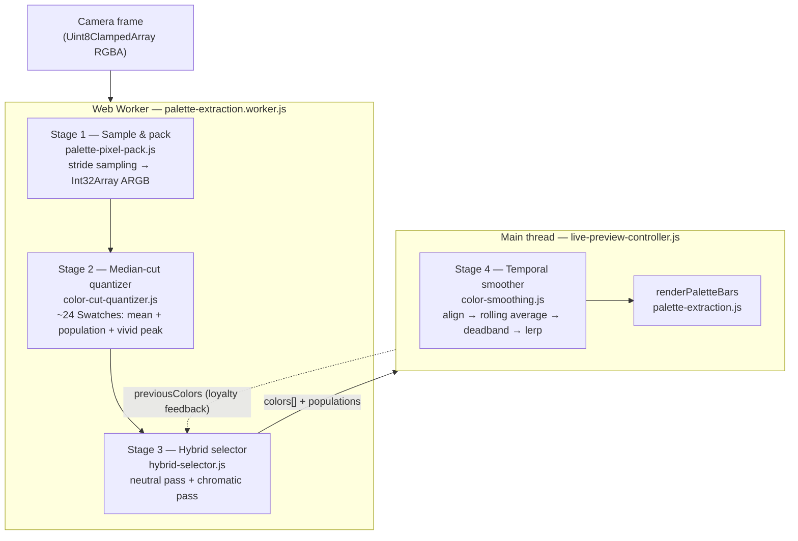
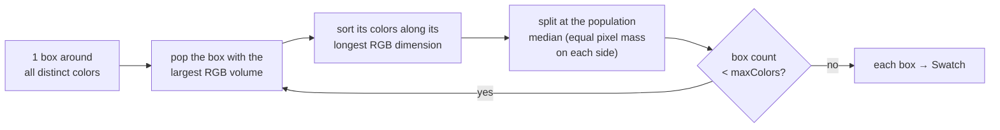
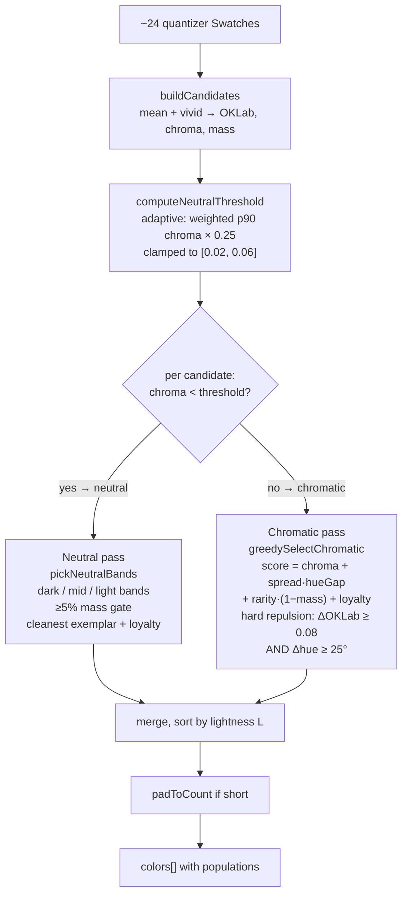
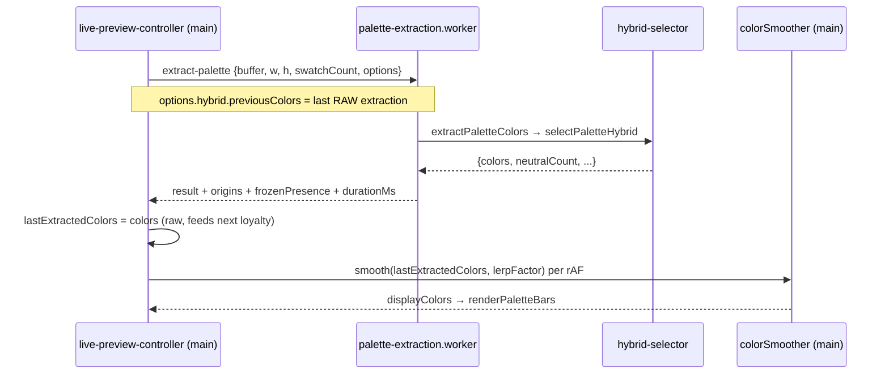

# The perceptual extraction pipeline — a deep dive

A course-style tour of how PaletCam turns a live camera frame into a palette. It covers the theory (color spaces, why averages mute colors), every stage of the code, and the design decisions behind them. Read `docs/extraction-refactor.md` for the *history* of how this design was chosen; this document explains the *present* — what ships, how it works, and why.

**Reading order if you're new:** §1 (theory) → §2 (map) → §3–§6 (the four stages, in dataflow order) → §7 (adaptivity summary) → §8 (the classic path, for contrast).

---

## 1. Theory foundations

### 1.1 sRGB is not a geometric space

Camera pixels arrive as sRGB bytes (0–255 per channel). Two facts make raw sRGB a bad space for palette math:

1. **Gamma.** sRGB values are gamma-encoded: the byte value is roughly the *perceived* brightness, not the physical light intensity. Averaging gamma-encoded bytes darkens and distorts mixtures. Converting to **linear sRGB** (undo the gamma curve — `srgbToLinear` in `color-math.js`) restores physical light so linear math is meaningful.
2. **Perceptual non-uniformity.** Even in linear RGB, equal Euclidean distances do not look equally different. A distance of 30 between two greens can be invisible; the same distance between two blues can be obvious. Any threshold ("are these two colors distinct?") tuned in RGB is wrong somewhere.

### 1.2 OKLab: the working space

**OKLab** (Björn Ottosson, 2020) is designed so Euclidean distance ≈ perceived difference. The conversion (`rgbToOklab` in `color-space-oklch.js`) is:

```
sRGB bytes → linear sRGB → LMS cone response (matrix M1) → cube root → OKLab (matrix M2)
```

The cube root models the eye's compressive response to light. The result is three Cartesian coordinates:

- **L** — lightness, 0 (black) to 1 (white)
- **a** — green (−) ↔ red (+) axis
- **b** — blue (−) ↔ yellow (+) axis

The vertical **L axis at a = b = 0 is the neutral spine**: every grey, black, and white lives on it. Distance *from* that spine is chroma; the *angle* around it is hue.

### 1.3 OKLCH: the same space, polar coordinates

**OKLCH** is OKLab with the (a, b) plane expressed in polar form:

```
C (chroma) = √(a² + b²)        — how far from neutral
H (hue)    = atan2(b, a)       — which direction (an angle, 0–360°)
```

This distinction drives a hard rule in this codebase:

> **Do geometry in OKLab. Derive C/H only for semantics.**
> Distance, averaging, clustering all use (L, a, b) — signed linear axes with no wrap-around. Hue is an *angle*: linear math on it is wrong at the 0°/360° seam (the old "reds get mangled" bug). Chroma and hue are only computed to *ask questions*: "is this neutral?" (C below threshold), "are these hues far apart?" (angular gap).

`rgbToOklch` is literally `rgbToOklab` + the polar conversion — same space, different questions.

### 1.4 Why averages mute colors

Every classical palette extractor reports the **mean** of a pixel cluster. But real-world color regions are not solid: a red mug has highlights, shadows, and edge pixels blending into the background. Averaging that cloud pulls the result **toward the grey spine** — chroma is a distance, and the mean of scattered points is always closer to the center than the vivid rim. Three stacked averages (cluster mean → temporal mean → display lerp) is why old PaletCam palettes looked muddy.

The fix (§5.5) is to keep, per cluster, both the **mean** (soft, representative) and the **highest-chroma real pixel** (vivid peak), and blend between them with a single **Tone** knob. Vivid comes from a real observed pixel, so it can't invent colors that weren't there.

### 1.5 Design constraint: live camera, zero tuning

PaletCam is a live tool: extraction runs ~5×/second on a phone. That imposes:

- **Cheap**: bounded pixel counts, integer histograms, no per-pixel OKLab conversion of the full frame.
- **Zero per-image tuning**: everything scene-dependent must be *adaptive* (computed from the frame), not a slider. The exposed knobs (§9) shape taste, not correctness.
- **Temporally stable**: near-equal candidates must not flip the palette every frame. Two mechanisms handle this: selection *hysteresis* (§5.6) and display *smoothing* (§6).

---

## 2. Map of the territory

### 2.1 Dataflow



Two feedback loops keep the live feed calm: the selector receives its **own previous output** as a stability bias (loyalty, §5.6), and the smoother filters what the user actually sees (§6).

### 2.2 Files

| File | Role |
|---|---|
| `src/modules/palette-pixel-pack.js` | Stage 1 — stride sampling, ARGB packing |
| `src/modules/color-cut-quantizer.js` | Stage 2 — median-cut, `Swatch {rgb, population, vividRgb}` |
| `src/modules/hybrid-selector.js` | Stage 3 — **the perceptual selector** (this doc's core) |
| `src/modules/color-smoothing.js` | Stage 4 — temporal smoothing on the main thread |
| `src/modules/color-space-oklch.js` | OKLab/OKLCH conversions |
| `src/modules/color-math.js` | `srgbToLinear`, `rgbToHsl`, RGB distances |
| `src/modules/palette-extraction.js` | Entry point: defaults + `extractPaletteColors` → `selectPaletteHybrid` |
| `src/workers/palette-extraction.worker.js` | Worker shell: runs extraction off the UI thread |
| `src/modules/app/live-preview-controller.js` | Orchestration: options, `previousColors`, smoothing, rendering |
| `src/app-settings.js` | Defaults (`DEFAULT_HYBRID_SETTINGS`) and persistence |
| `src/modules/debug/*`, `public/debug-extraction.html` | The A/B harness where this pipeline was designed |

**Why "hybrid"?** The selector marries the *production* candidate source (median-cut quantizer — cheap, integer-based, temporally stable on video) with the *experimental* perceptual selection logic (OKLab, neutral reservation, repulsion, tone) that was prototyped in `src/modules/debug/experimental-selector.js`. The debug prototype clustered pixels itself with an OKLab grid; the shipped hybrid reuses the quantizer's boxes as clusters instead.

---

## 3. Stage 1 — Sampling & packing

`packImageDataToArgb8888(imageData, w, h, { maxPixels })` in `palette-pixel-pack.js`.

The quantizer must not see millions of pixels 5×/second, so the frame is subsampled with a **square stride**:

```
stride = ceil( √(totalPixels / maxPixels) )
```

Taking every `stride`-th pixel in *both* x and y keeps the sample spatially uniform — the color *distribution* is roughly preserved, which is all a histogram-based quantizer needs. With the perceptual selector `maxPixels` is 40 000 (`DEFAULT_MAX_QUANTIZER_PIXELS`), so a 1920×1080 frame (2 M pixels) gets stride 8 → ~32 k samples.

Each sampled pixel is packed into one `Int32` as `0xFFRRGGBB`; fully transparent pixels (`alpha === 0`) are skipped so they can't pollute the histogram. The output is a *throwaway* buffer — important because Stage 2 mutates it in place.

---

## 4. Stage 2 — Median-cut quantization

`ColorCutQuantizer` in `color-cut-quantizer.js` (descended from Android's Palette API, heavily trimmed). Its job: reduce ~40 000 pixels to a pool of **~24 candidate clusters** ("Swatches") for the selector.

### 4.1 The histogram: 15-bit color bins

Each 24-bit RGB pixel is quantized to **5 bits per channel** (32 levels), giving 32³ = 32 768 possible bins:

```
r5 = r8 >> 3;  g5 = g8 >> 3;  b5 = b8 >> 3
bin = (r5 << 10) | (g5 << 5) | b5      // 15-bit code
```

One pass fills `histogram[bin] += 1`. This collapses sensor noise (nearby colors share a bin) and bounds all later work at 32 768 entries regardless of image size. The 128 KB histogram buffer is a module-level **shared buffer**, zeroed and reused per extraction instead of reallocated — this runs 5×/second.

If the image has ≤ maxColors distinct bins, they're returned directly. Otherwise, median-cut runs.

### 4.2 Median-cut: recursive box splitting

Picture the occupied bins as points in the RGB cube. Median-cut wraps them in boxes (`Vbox`) and repeatedly splits the box that most needs it:



Key choices, and why they matter downstream:

- **Split the largest-volume box** (max-heap by `getVolume()`): volume = color *spread*, so visually diverse regions get subdivided before big flat ones. This is what lets a small-but-distinct color survive as its own box.
- **Split along the longest dimension at the population median**: each cut halves the pixel *mass*, so boxes end up either "big uniform region" or "small distinct region" — both useful candidates.
- **The significant-octet trick** (`modifySignificantOctet`): to sort along green or blue, the 15-bit codes are temporarily re-packed as GRB/BGR so a plain numeric `TypedArray.sort()` sorts by the right channel, then re-packed back. Cheap, allocation-free.
- Splitting is done in **RGB, not OKLab** — deliberately. Integer bin math is fast and, crucially for video, *deterministic and stable*: a tiny frame change moves few bins, so boxes barely move. (An earlier attempt to pack OKLCH into the same ints corrupted reds via hue wrap-around; it's why the "geometry in OKLab, only where it counts" rule exists.)

### 4.3 What a Swatch carries

`getAverageColor()` reduces each box to:

```js
Swatch {
  rgb,         // population-weighted MEAN of the box   → the "soft" representative
  population,  // pixel mass (sample counts)            → the selector's "mass"
  vividRgb,    // highest-OKLab-chroma bin in the box   → the "vivid peak"
}
```

`vividRgb` is the anti-muting hook (§1.4): while the mean is the box's *average* appearance, the vivid exemplar is the most saturated color that *actually occurred* in it. Chroma of a bin is a pure function of its 15-bit code, so it's memoized in a lazily-filled 32 768-entry `Float32Array` LUT (`quantizedChroma`) — after warm-up, live frames pay ~zero for it.

---

## 5. Stage 3 — The hybrid selector

`selectPaletteHybrid(imageData, width, height, swatchCount, params)` in `hybrid-selector.js`. This is the heart of the pipeline. Everything below happens on the ~24 quantizer swatches — tiny data, so it can afford real perceptual math.



### 5.1 Candidate building

`buildCandidates` converts each Swatch into the selector's working record: both representatives (`meanRgb`, `vividRgb`) are converted to OKLab; the candidate keeps the mean's `(L, a, b)`, its chroma `c`, the vivid peak's chroma `vividC`, and `mass` (population). All subsequent decisions happen on these ~24 records.

### 5.2 The adaptive neutral threshold

The first scene-adaptive decision: **where does "neutral" end and "color" begin?** A fixed chroma cutoff fails both ways — a beige wall reads as "a color" in a drab scene but as "the neutral background" in a vivid one.

`computeNeutralThreshold` scales the cutoff to the scene's own chroma range:

1. Sort candidates by chroma, walk up accumulating **mass** until 90% of pixels are covered → the mass-weighted **90th-percentile chroma** (p90). This is "how chromatic this scene gets", robust to a few outlier candidates because it's weighted by pixel population.
2. Threshold = `p90 × 0.25`, clamped to **[0.02, 0.06]**.

Intuition: neutral = "less than a quarter as chromatic as the scene's vivid end". The floor (0.02) stops everything reading as neutral in a grey scene; the cap (0.06) stops genuinely tinted colors being absorbed as "neutrals" in an extremely vivid scene. (These are OKLab chroma units; for scale, a fully saturated sRGB red has chroma ≈ 0.26.)

Every candidate with `c < threshold` goes to the neutral pass, the rest to the chromatic pass. **Two passes because the two populations obey different aesthetics**: neutrals should be *clean* and span the lightness range (a good black, a good white); chromatic picks should be *vivid* and span the hue circle. One scoring function can't want both.

### 5.3 The neutral pass — reserving black & white

Historically the worst failure: black and white are massive in most photos but score zero on any chroma/saturation axis, so scorers starved them. The fix is **reservation**: neutrals get their own slot budget *before* the chromatic competition starts.

**Budget.** `neutralFraction` = neutral mass / total mass. Requested neutral slots = `round(swatchCount × neutralFraction)`, capped at `min(swatchCount − 1, 3)` so neutrals can never crowd out all color (unless the scene has *no* chromatic candidates at all, in which case they get everything).

**Bands.** `pickNeutralBands` splits neutral candidates by lightness into **dark** (L < 0.34), **mid** (0.34–0.66), and **light** (≥ 0.66) — i.e. "a black, a grey, a white", the three neutrals a designer would pull. A band only earns a slot if it holds **≥ 5% of total pixel mass** (`minBandMass`): this kills the invisible anti-aliasing greys that every image technically contains. Bands are then taken heaviest-first up to the budget.

**Exemplar.** Within a winning band, the pick is the **cleanest** candidate — *lowest* chroma, minus a small loyalty bonus (`chroma − 0.02 × loyalty`, §5.6) so the band doesn't flap between two similarly-clean greys across frames. Note the inversion: chromatic picks maximize chroma, neutral picks minimize it. A neutral's job is to be *convincingly* neutral.

The exemplar's reported `population` is the **whole band's mass**, not its own — it stands for the band.

### 5.4 The chromatic pass — greedy selection with repulsion

`greedySelectChromatic` fills the remaining `swatchCount − neutralPicks` slots. It is a greedy loop: each iteration scores every remaining candidate against what's already picked, and takes the best.

**Preprocessing.** Each candidate gets its **Tone-blended** color (§5.5) computed up front, plus that blend's OKLab position and hue, and two scene-relative normalizations:

- `chromaNorm = vividC / maxChroma` — vividness *relative to this scene's most vivid candidate* (so the mechanism works identically in pastel and neon scenes);
- `rarityNorm = 1 − mass / maxMass` — small clusters score high. This is the champion of the small-but-salient accent (the pink tray, the yellow sign) that raw mass would bury.

**Hard constraints (the "repulsion").** A candidate is *ineligible* — not merely penalized — if, versus **any** already-picked color:

1. OKLab distance of the blended colors < `repulsionRadius` (default **0.08**), or
2. hue gap < **25°** (`hueRadiusDeg`, hardcoded).

Think of it as a forbidden ball around each pick, plus a forbidden wedge of hue. The distance ball alone isn't enough: two reds can sit > 0.08 apart via lightness and still read as "red and red". The hue wedge is what stops one dominant hue claiming every slot. Hue gaps use the wrap-aware angular distance (`hueGap`: `min(Δ, 360−Δ)`), never linear subtraction — see §1.3.

**Score (among eligible candidates):**

```
score = chromaNorm                       // be vivid
      + spreadStrength × hueSpread       // be a NEW hue (min angular gap to picks, 0..1)
      + rarityStrength × rarityNorm      // champion small clusters
      + loyaltyStrength × loyaltyNorm    // prefer last frame's picks (§5.6)
```

with defaults `spreadStrength = 0.6`, `rarityStrength = 0.2`, `loyaltyStrength = 0.3`. The first pick (nothing chosen yet) has `hueSpread = 0`, so it's essentially the most vivid candidate, nudged by rarity and loyalty.

**Relaxation.** If *no* candidate satisfies both constraints (small palettes of near-identical hues, or a generous radius), the loop falls back to **farthest-point selection**: pick the candidate maximizing its minimum blended-OKLab distance to the chosen set. The constraints soften rather than fail — you always get maximally-separated colors even when "separated enough" is impossible.

### 5.5 Tone: the anti-muting blend

Every chromatic pick's displayed color is:

```js
displayed = lerpRgb(meanRgb, vividRgb, tone)     // tone = 0.85 by default
```

- `tone → 0`: the cluster mean — soft, muted, classical extractor behavior.
- `tone → 1`: the highest-chroma real pixel — maximally vivid, guaranteed to have existed in the frame.

At 0.85 the palette leans strongly vivid while the residual 15% of mean tames single-pixel extremes. This single scalar replaces what used to require per-image weight tuning. Two subtleties:

- The blend is computed **before** scoring/repulsion, and both operate on the *blended* color — the selector separates the colors the user will actually *see*, not the abstract cluster means.
- The lerp is done in RGB between two nearby real colors (cheap and safe at short range); positions are then re-measured in OKLab for the geometry. Neutrals skip the blend entirely — their `meanRgb` ships as-is, since "vivid neutral" is a contradiction.

### 5.6 Loyalty: selection hysteresis

On a live feed, two near-equal candidates (score 0.612 vs 0.609) can trade places every frame — the palette flickers even though the scene is static. **Loyalty** biases the race toward incumbents:

- The controller passes the **previous raw extraction** as `previousColors` (see `getPaletteExtractionOptions` in `live-preview-controller.js` — raw, *not* smoothed, so the two stability systems don't feed back into each other).
- `computeLoyalty` maps a candidate's distance to the nearest previous color into a bonus: 1 at distance 0, fading linearly to 0 at `LOYALTY_RADIUS = 0.1` OKLab.
- Weighted by `loyaltyStrength` (0.3) in the chromatic score; in the neutral pass it subtracts up to `0.02` chroma-units from the exemplar cost.

This is textbook **hysteresis**: the state you're in gets a bonus, so switching requires a genuinely better challenger, not a coin flip. When the scene actually changes, new candidates are far from all previous colors, loyalty is 0 everywhere, and the palette snaps freely. `hybrid-selector.test.js` pins both properties ("rerunning with its own output as previousColors is stable", "loyalty steers a near-equal pick toward the previous palette").

### 5.7 Assembly: sort & pad

Neutral and chromatic picks are merged and **sorted by OKLab lightness L**, giving the familiar dark→light bar order and, incidentally, more stable bar *positions* across frames than score order would.

If picks < `swatchCount` (a genuinely low-variety scene where repulsion + hue-wedge exhausted the pool), `padToCount` fills from the remaining chromatic candidates (tone-blended, deduplicated) and, as a last resort, duplicates the final color. The app renders a fixed number of bars, so the contract is "always exactly N colors" — the earlier design question "pad or show fewer?" was settled as *pad*.

The returned object is `{ colors, candidates, neutralCount, neutralThreshold }` — the extras feed the debug harness's stats footer and overlays.

---

## 6. Stage 4 — Temporal smoothing

`createColorSmoother()` in `color-smoothing.js` — main-thread, display-side. Loyalty (§5.6) stabilizes *which colors get picked*; the smoother stabilizes *what the user sees* between and across extractions (~5/second, while rendering runs at rAF rate). Four mechanisms, in order:

1. **Alignment** (`reorderToMatchReference`): extraction output order carries no identity, so incoming colors are greedily matched to the previous palette's slots by closest RGB pair. Without this, two swatches swapping positions would read as both "changing color".
2. **Rolling average**: the last `ACCUMULATOR_MAX_SIZE = 5` aligned extractions (~1 s of history) are averaged, filtering single-frame sensor noise.
3. **Deadband**: if a slot's target is within `COLOR_DISTANCE_THRESHOLD = 24` (RGB) of what's displayed, the displayed color is *kept identical* — sub-threshold shimmer produces zero visual change.
4. **Lerp**: past the deadband, the displayed color eases toward the target by `lerpFactor` per frame instead of jumping.

Yes — step 2 is an average, the thing §1.4 warns about. The tension is resolved upstream: the selector's tone blend puts the *raw* colors far from the grey spine to begin with, and 5 frames of an already-vivid, loyalty-stabilized color barely move it. (Residual idea from the refactor notes, still open: a chroma floor on the smoothed output.)

`live-preview-controller.js` owns one smoother instance and resets it when the camera restarts.

---

## 7. Adaptivity — what the pipeline decides from the scene

Collected in one place, since "it adapts" is the pipeline's defining property:

| Decision | Mechanism | Where |
|---|---|---|
| Where "neutral" ends | mass-weighted p90 chroma × 0.25, clamped [0.02, 0.06] | `computeNeutralThreshold` |
| How many neutral slots | proportional to neutral pixel mass, cap min(N−1, 3) | `selectPaletteHybrid` |
| Which neutrals qualify | lightness band must hold ≥ 5% of pixel mass | `pickNeutralBands` |
| What counts as "vivid" | `chromaNorm` normalized to *this scene's* max chroma | `greedySelectChromatic` |
| What counts as "rare" | `rarityNorm` normalized to this scene's biggest cluster | `greedySelectChromatic` |
| When constraints yield | repulsion relaxes to farthest-point when unsatisfiable | `greedySelectChromatic` fallback |
| Sampling density | stride from frame size vs `maxQuantizerPixels` | `computePixelStride` |
| Where clusters form | median-cut spends splits on high-volume (diverse) regions | `Vbox` heap |
| What changes frame-to-frame | loyalty to previous extraction; smoother deadband | §5.6, §6 |

The debug prototype also had `suggestSelectorParams` (auto Variety/Distinctness from hue concentration and ab-spread); the shipped app uses fixed defaults with the config-panel sliders instead — the adaptive normalizations above turned out to carry most of the weight.

---

## 8. The classic path (removed, kept for contrast)

The old selector (`palette-extract-median-cut.js` + `palette-scoring.js`, the `paletteSelector: "current"` mode) was **deleted in July 2026** — the perceptual selector is now the only pipeline. Understanding it still clarifies what the hybrid fixed:

Same Stage 1 + 2, then `rankQuantizedCandidates` greedily maximized a **weighted sum** over four normalized scores — chroma (HSL saturation), luma spread (distance from mid-lightness), hue rarity (inverse histogram over 12 hue buckets), diversity (min RGB distance to picks) — mixed 85/15 with a log-scaled population score. (A dormant `"perceptual"` scoring *model* inside the scorer swaps HSL for OKLCH features; not to be confused with the perceptual *selector*, which bypasses this scorer entirely.)

Structural differences from the hybrid, and their consequences:

| Classic | Hybrid | Consequence |
|---|---|---|
| diversity is a *soft* score term | repulsion is a *hard* constraint + hue wedge | classic can pick near-duplicates when other terms dominate; hybrid can't |
| neutrals compete on the same axes | neutrals get reserved slots, opposite objective | classic starves black/white; hybrid guarantees them proportional presence |
| displays box means | tone-blends toward the vivid peak | classic mutes; hybrid doesn't |
| 4 interacting weights to tune per image | scene-adaptive internals + taste knobs | classic needs hand-tuning; hybrid is default-good |
| no memory of previous frame | loyalty hysteresis | classic relies wholly on the smoother for stability |

---

## 9. The control surface

`DEFAULT_HYBRID_SETTINGS` (`src/app-settings.js`), persisted per-user, exposed in the config panel (preset chips + stepped sliders):

| Param | Default | Range/unit | Meaning (user-facing name) |
|---|---|---|---|
| `spreadStrength` | 0.6 | 0–1 | **Variety** — monochrome ↔ rainbow: weight of the new-hue bonus |
| `repulsionRadius` | 0.08 | OKLab distance | **Distinctness** — minimum perceptual separation between picks |
| `tone` | 0.85 | 0–1 | **Tone** — soft cluster mean ↔ vivid real pixel |
| `rarityStrength` | 0.2 | 0–1 | small-cluster champion weight |
| `loyaltyStrength` | 0.3 | 0–1 | hysteresis strength on a live feed |

Fixed internals (deliberately not knobs): hue wedge 25°, `LOYALTY_RADIUS` 0.1, `NEUTRAL_LOYALTY_WEIGHT` 0.02, neutral band edges 0.34/0.66, band gate 5%, threshold clamps [0.02, 0.06], neutral cap 3, pool size 24, pixel cap 40 000. Each was settled empirically in the harness across ~216 test images; promoting them to settings would recreate the tuning problem the redesign exists to kill.

Intentionally out of scope: accents under ~0.1% of pixels (tiny text, LEDs). At 40 k samples they're a handful of pixels — indistinguishable from noise; chasing them injects speckle everywhere.

---

## 10. Worker & app wiring



Routing: `extractPaletteColors` (`palette-extraction.js`) applies the pool-size/pixel-budget defaults and calls `selectPaletteHybrid` directly. The worker also computes swatch **origins** (where in the frame each color lives, for the origin badges) and **frozen presence** (whether a pinned color still exists in view); both are outside this doc's scope but ride the same message.

The pixel buffer crosses the worker boundary as a transferable; the packed copy inside is throwaway, which is why the quantizer is allowed to mutate it (it overwrites pixels with their 15-bit codes during histogramming — pass a copy if you ever reuse a buffer, as `extraction-trace.js` does).

---

## 11. Gotchas & invariants

- **Never do linear math on hue.** Angles wrap. Use `hueGap`-style angular distance, or stay in Cartesian (a, b). This bug has been shipped once already.
- **The quantizer mutates its input** (§10). The `packed` buffer in `selectPaletteHybrid` is fresh each call, so it's safe there.
- **`previousColors` must be the raw extraction**, never the smoothed display colors — otherwise loyalty and the smoother form a feedback loop that can wander off the actual scene.
- **Neutral picks report band mass**, not exemplar mass (§5.3) — population consumers (origin badges, sorting) rely on this.
- **The output length is always exactly `swatchCount`** (padding guarantees it); `colors` may contain duplicates in pathological low-variety scenes.
- **Chroma LUT & shared histogram are module-level state** — fine in the worker (single realm), but two concurrent quantizers in one realm would race the histogram. There is exactly one extraction in flight at a time by design.
- Tone's effect is subtle on tight clusters (mean ≈ peak) and pronounced on broad real-photo regions — don't judge it on synthetic flat-color tests.

## 12. Where the tests point

- `hybrid-selector.test.js` — the selector contract: exact count with populations, self-stability under loyalty, loyalty steering, degenerate input.
- `color-cut-quantizer.test.js` — quantizer behavior incl. `vividRgb` exemplars.
- `color-smoothing.test.js` — alignment, accumulator, deadband.
- `color-math.test.js`, `palette-extraction.test.js` — primitives and the entry-point contract (guards, option forwarding).

And the best learning tool remains the harness: `bun run dev` → http://localhost:3000/debug-extraction.html — every §5 concept (neutral spine, repulsion balls, candidates vs picks, threshold stats) is visible there in 3D, on your own images.
